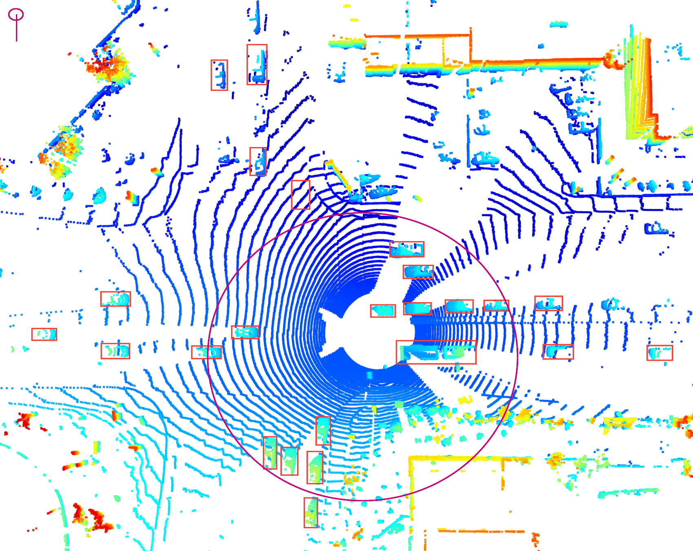
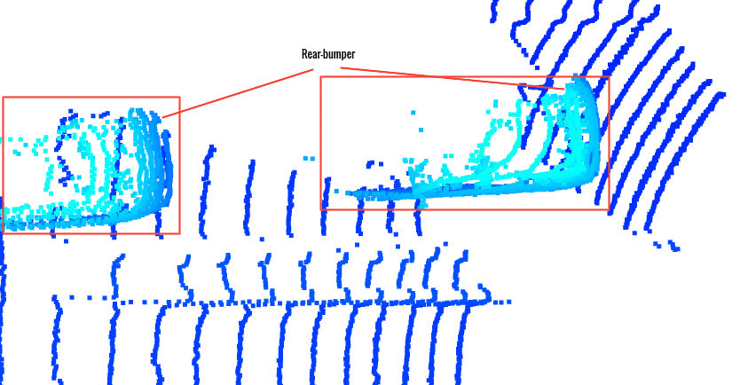
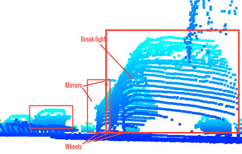
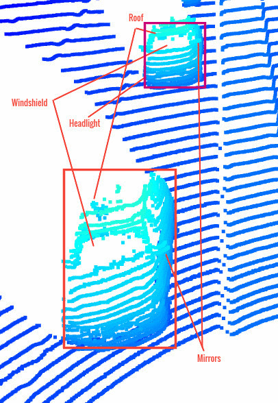
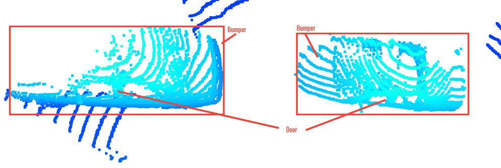

# Mid-Term Project: 3D Object Detection

## Section 1 : Compute Lidar Point-Cloud from Range Image

### Visualize range image channels (ID_S1_EX1)
Extracted range and intensity values from range image data and filtered non-zero values.
Results:

### Visualize lidar point-cloud (ID_S1_EX2)
- Find and display 6 examples of vehicles with varying degrees of visibility in the point-cloud

In the above point cloud, vehicles inside the circle are closer to the ego vehicle and 
therefore have large no. of points and vehicles outside the circle are far away and thus have fewer points.

[//]: # (![ri]&#40;img/v3.png&#41;)

[//]: # (![ri]&#40;img/v5.png&#41;)

[//]: # (![ri]&#40;img/v6.png&#41;)

- Identify vehicle features that appear as a stable feature on most vehicles (e.g. rear-bumper, tail-lights) and describe them briefly. 

1. In the image above driver head and mirror are clearly distinguished.

2. In the image above rear bumper can be identified in a single look.

3. Paying a little close observation steering wheels are visible in the above image.

4. In the image above break light, mirrors and wheels are visible.

5. In the image above windshields, headlights and mirrors are seen.

6. In the image above door and side windows are visible.
