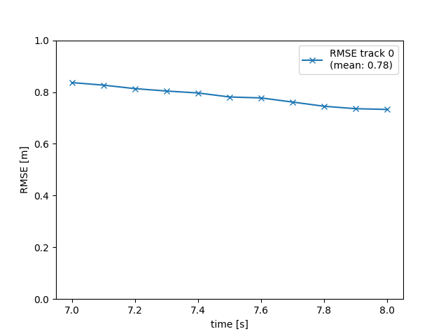

# Writeup: Track 3D-Objects Over Time

Please use this starter template to answer the following questions:

### 1. Write a short recap of the four tracking steps and what you implemented there (filter, track management, association, camera fusion). Which results did you achieve? Which part of the project was most difficult for you to complete, and why?

#### Four tracking steps:
- Filtering: 
Implemented an EKF filter to track a single target with lidar measurement. Implemented predict and update function for 
an EKF, computation of a system matrix for constant velocity process model in 3D and the 
corresponding process noise covariance depending on the current timestep dt. 

- Track management: Implemented the initialization of x, P, track score and track status and update routine for those four parameters.
- 

- Association: Created association matrix based on Mahalanobis distance and kept a track of unassociated track and measurements.
The  image below shows ghost track.

- Camera fusion: Added camera fusion by adding camera measurements to the Kalman Filter.
- 

### 2. Do you see any benefits in camera-lidar fusion compared to lidar-only tracking (in theory and in your concrete results)? 
Adding camera fusion improves the accuracy of the tracking as it improves the detection and decreases overall error in tracking.

### 3. Which challenges will a sensor fusion system face in real-life scenarios? Did you see any of these challenges in the project?
There could be a lot of challenges in real-world scenarios like:
- occlusion in either camera or lidar.
- no knowledge of lidar to camera transformation.
- opaque object in front of camera or lidar.

### 4. Can you think of ways to improve your tracking results in the future?
- improving detection model.
- trail and error with tracking hyperparameter values.
- adding more sensor.
